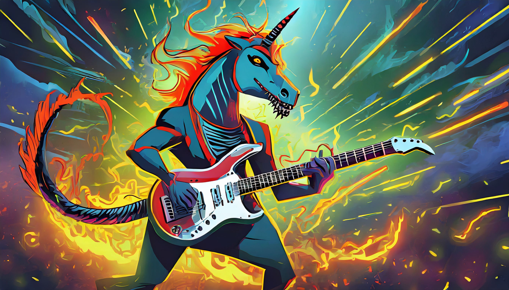

<div align="center">

# Mustango: Toward Controllable Text-to-Music Generation

[Demo]() [Model]() [Website and Examples](https://amaai-lab.github.io/mustango/) [Paper](https://arxiv.org/abs/2311.08355) [Dataset](https://huggingface.co/datasets/amaai-lab/MusicBench)
</div>

Meet Mustango, an exciting addition to the vibrant landscape of Multimodal Large Language Models designed for controlled music generation. Mustango leverages Latent Diffusion Model (LDM), Flan-T5, and musical features to do the magic!

<div align="center">
  
</div>


## Datasets

The [MusicBench](https://huggingface.co/datasets/amaai-lab/MusicBench) dataset contains 52k music fragments with a rich music-specific text caption. 
## Subjective Evaluation by Expert Listeners

| **Model** | **Dataset** | **Pre-trained** | **REL** ↑ | **MCM** ↑ | **MTM** ↑ | **AQ** ↑ | **OM** ↑ | **RP** ↑ | **HC** ↑ |
|-----------|-------------|-----------------|-----------|-----------|-----------|----------|----------|----------|----------|
| Tango     | MusicCaps   | ✓               | 4.35      | 2.75      | 3.88      | 3.35     | 2.83     | 3.95     | 3.84     |
| Tango     | MusicBench  | ✓               | 4.91      | 3.61      | 3.86      | 3.88     | 3.54     | 4.01     | 4.34     |
| Mustango  | MusicBench  | ✓               | 5.49      | 5.76      | 4.98      | 4.30     | 4.28     | 4.65     | 5.18     |
| Mustango  | MusicBench  | ✗               | 5.75      | 6.06      | 5.11      | 4.80     | 4.80     | 4.75     | 5.59     |


## Citation
Please consider citing the following article if you found our work useful:
```
@misc{melechovsky2023mustango,
      title={Mustango: Toward Controllable Text-to-Music Generation}, 
      author={Jan Melechovsky and Zixun Guo and Deepanway Ghosal and Navonil Majumder and Dorien Herremans and Soujanya Poria},
      year={2023},
      eprint={2311.08355},
      archivePrefix={arXiv},
}
```
